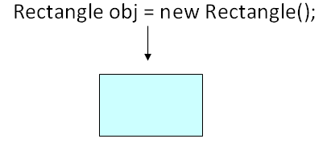
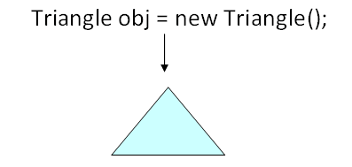
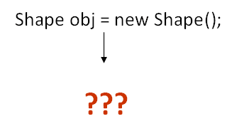

# Abtract class là gì ?
Abstract clsas là class trong Java, có định nghĩa một hoặc nhiều method abstract

Hãy xem xét hệ thống phân cấp class sau bao gồm một class Shape được kế thừa bởi ba class Rectangle, Circle, và Triangle. Class Shape được tạo để lưu những thuộc tính và method dùng chung được chia sẻ bởi 3 clsas Rectangle, Circle, and Triangle. **calculateArea** là một method như vậy, được chia sẻ cho 3 class khác và hiện diện trong class Shape.


Bây giờ, giả sử bạn viết code để tạo các đối tượng cho các class mô tả ở trên. Hãy quan sát các đối tượng sẽ trông như thế nào trong một thế giới thực tế.

Một object của class Rectangle sẽ đưa ra một hình chữ nhật, một hình dạng rất phổ biến mà chúng ta quan sát hằng ngày



Một object của class Triangle sẽ đưa ra hình tam giác, lại một lần nữa rất phổ biến với chúng ta.



Nhưng một object của clsas Shape trông giống thế giới thực tế là gì ?



Nếu bạn quan sát class Shape phục vụ cho mục tiêu của chúng ta là đạt được thừa kế và đa hình. Nhưng nó không được xây dựng để khởi tạo. Những class như vậy được đánh dấu là trừu tượng. Một abstract class thì không thể được khởi tạo.

## Cú pháp:
```java
abstract class Shape{
	// code
}
```

**Có thể là bạn KHÔNG gắn nhãn class Shape là Abstract và sau đó khởi tạo nó. Nhưng đối tượng như vậy sẽ không được sử dụng trong mã code của bạn và sẽ mở ra số lượng các lỗi tiềm ẩn. Do đó điều này là không mong muốn.**

# Abstract method là gì ?
Một Abstract method là một method mà chỉ có phần định nghĩa method, không có phẩn triển khai.

Như chúng ta đã biết, công thức tính toán diện tích cho rectangle, circle, & triangle là khác nhau. Method calculateArea sẽ phải được ghi đè bởi class kế thừa. Nó sẽ không có ý nghĩa gì nếu định nghĩa nó trong class Shape, nhưng chúng ta muốn chắc chắn rằng tất cả các class kế thừa đều phải có method đó.

Những method như vậy được đánh dấu là **abstract**

## Cú pháp:
```java
abstract public void calculateArea();
```

Đối với một method abstract thì không có phần triển khai là bắt buộc. Chỉ có phần khai báo method được định nghĩa.

# Abstract clsas trong Java: Điều quan trọng
- Một abstract class cũng có thể có những method cụ thể
- Đối với mục đích thiết kế, một class có thể khai báo abstract mặc dù nó không chứa bất cứ method abstract nào.
- Tham chiếu của một abstract class có thể chỉ đến class con của chính nó, bằng cách đó đạt được tính đa hình trong quá trình khởi chạy. Ví dụ: Shape obj = new Rectangle();
- Một class bắt buộc đánh dấu abstract nếu nó có một hoặc nhiều method abstract

# Từ khó Final trong Java
Từ khóa **final** áp dụng cho class, method, biến. Ý nghĩa của từ khóa final khác nhau giữa các bối cảnh nhưng về ý tưởng cần thiết là như nhau.

- Một final class thì không thể kế thừa
- Một biến final sẽ trở thành hằng số và giá trị của nó sẽ không thay đổi.
- Một method final thì không thể overriding. Nó thực hiện như vậy vì lý do bảo mật, và những method như vậy được sử dụng để tối ưu hóa.

## Ví dụ: Học từ khóa abstract và final 
**Step 1**: Copy đoạn mã sau vào notepad
```java
abstract class Shape{
   final int b = 20;
   public void display(){
     System.out.println("This is display method");
   }
   abstract public void calculateArea();
}

public class Rectangle extends Shape{
   public static void main(String args[]){
      Rectangle obj = new Rectangle();
      obj.display();
     //obj.b=200;
  }
  //public void calculateArea(){}
}
```

**Step 2**: Biên dich và chạy code.

**Step 3**: Có lỗi ? Một abstract method không thể được kế thừa. Để xử lý vấn đề này thì bỏ comment ở:
```java
public void calculateArea(){}
```

**Step 4**: Bỏ comment ở line dưới và chạy chương trình
```java
obj.b=200;
```

**Step 5**: Có lỗi ? Lý do: biến b là final.

[Back](./)
