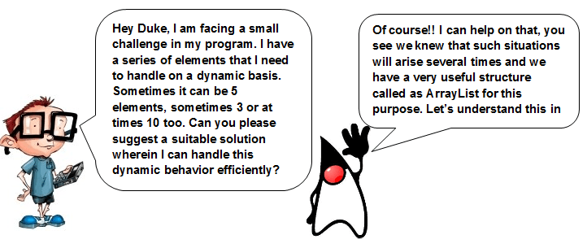
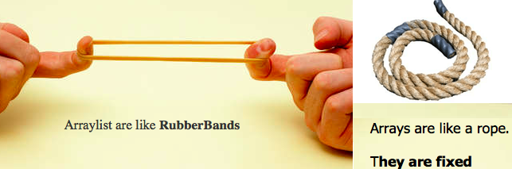
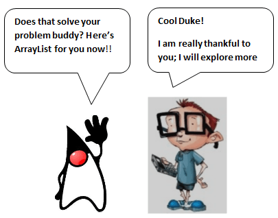

# ArrayList trong Java là gì 
ArrayList là một cấu trúc dữ liệu mà có thể kéo dài kích thước để chứa thêm phần tử trong chính nó và co lại về một kích thước nhỏ hơn nếu các phần tử bị xóa đi. Nó là một cấu trúc dữ liệu quan trọng phổ biến trong xử lý hành vi động của các phần tử.

Tự hỏi làm thế nào ArrayList trở nên phổ biến, nhìn đoạn trao đổi sau:


Xem bức ảnh dưới đây, một người đang kéo dài sợi dây su.
Trên thực tế, kích thước của sợi dây su là nhỏ hơn nhiều, nhưng khi được kéo dài thì nó có thể dài hơn rất nhiều so với kích thước thực tế và nó có thể chứa được nhiều hơn so với chính nó.
Bây giờ, xem xét bức ảnh tiếp theo. Nó đơn giản là một đoạn dây thừng. Nó không thể kéo dài và có một kích thước cố định.


Nó có thể tăng kích thước khi được yêu cầu để chứa các phần tử cần lưu trữ và khi các phần tử được loại bỏ, nó có thể co lại về kích thước nhỏ hơn.

Vì vậy, giống như vấn đề của bạn của tôi, với một mảng anh ấy dùng không thể tăng kích thước hoặc làm co lại, chúng ra có thể dùng ArrayList.

Mảng giống như sợi dây thừng được hiển thị ở hình trên. Chúng có một kích thước cố định, không thể mở rộng hoặc giảm kích thước so với kích thước gốc.

Vì vậy, sợi dây cao su giống như một ArrayList trong khi sợi dây thừng được xem xét như là một arrays.

Về mặt kỹ thuật thì nói rằng, Java ArrayList như là một mảng động, hoặc là một mảng có độ dài thay đổi.

Hiếu đoạn mã dưới đây để bạn có thể làm việc cùng ArrayList
```java
ArrayList<Object> a = new ArrayList<Object>();
```

# ArrayList method
**ArrayList add**: Cái này được sử dụng để thêm một phần tử vào Array List. Nếu một ArrayList sẵn sàng chứa các phần tử, một phần tử mới sẽ được thêm vào sau phần tử cuối cùng trừ khi chỉ mục được chỉ định.

**Cú pháp**
```java
add(Object o); 
```

**ArrayList remove**: Chỉ định phần tử sẽ được loại bỏ từ danh sách và thích thước sẽ giảm phù hợp. Tương tự, bạn cũng có thể chỉ định chỉ mục của phần tử sẽ bị loại bỏ.

**Cú pháp**
```java
remove(Object o);
```

**Java Array size**: Điều này sẽ trả về cho bạn số phần tử của ArrayList. Cũng giống như array, ở đây phần tử đầu tiên cũng bắt đầu với chỉ mục 0.

**Cú pháp**
```java
int size();
```

**ArrayList contains**: Method này sẽ trả về **true** nếu danh sách có chứa phần tử chỉ định. 

**Cú pháp**
```java
boolean contains(Object o);
```

# Ví dụ về ArrayList
```java
import java.util.ArrayList;
class Test_ArrayList {
 public static void main(String[] args) {
  //Creating a generic ArrayList
  ArrayList arlTest = new ArrayList();
  //Size of arrayList
  System.out.println("Size of ArrayList at creation: " + arlTest.size());
  //Lets add some elements to it
  arlTest.add("D");
  arlTest.add("U");
  arlTest.add("K");
  arlTest.add("E");

  //Recheck the size after adding elements
  System.out.println("Size of ArrayList after adding elements: " + arlTest.size());

  //Display all contents of ArrayList
  System.out.println("List of all elements: " + arlTest);

  //Remove some elements from the list
  arlTest.remove("D");
  System.out.println("See contents after removing one element: " + arlTest);

  //Remove element by index
  arlTest.remove(2);
  System.out.println("See contents after removing element by index: " + arlTest);

  //Check size after removing elements
  System.out.println("Size of arrayList after removing elements: " + arlTest.size());
  System.out.println("List of all elements after removing elements: " + arlTest);

  //Check if the list contains "K"
  System.out.println(arlTest.contains("K"));

 }
}
```

## Kết quả:
```java
Size of ArrayList at creation: 0
Size of ArrayList after adding elements: 4
List of all elements: [D, U, K, E]
See contents after removing one element: [U, K, E]
See contents after removing element by index: [U, K]
Size of arrayList after removing elements: 2
List of all elements after removing elements: [U, K]
true
```

**Lưu ý**: Để đơn giản, các phần tử trình bày trong ví dụ trên là các phần tử ký tự đơn lẻ. Bạn có thể thêm vào String, Integer, Boolean, ...



[Back](./)
