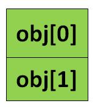
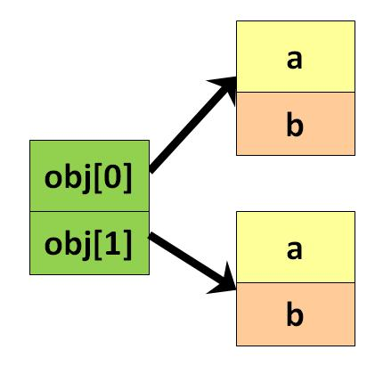

# Array là gì 
Không giống như mảng truyền thống chứa các giá trị như String, integer, Boolean, ... Arrays của Object chứa các object. Các phần tử của mảng chứa các vị trí của biến tham chiếu đến object.

## Cú pháp:
```java
Class obj[]= new Class[array_length]
```

## Ví dụ: Tạo một Arrays của Object
**Bước 1**: Viết đoạn mã như dưới đây:
```java
class ObjectArray{
   public static void main(String args[]){
     Account obj[] = new Account[2] ;
     //obj[0] = new Account();
     //obj[1] = new Account();
    obj[0].setData(1,2);
    obj[1].setData(3,4);
    System.out.println("For Array Element 0");
    obj[0].showData();
    System.out.println("For Array Element 1");
     obj[1].showData();
  }
}
class Account{
  int a;
  int b;
 public void setData(int c,int d){
   a=c;
   b=d;
 }
 public void showData(){
   System.out.println("Value of a ="+a);
   System.out.println("Value of b ="+b);
 }
}
```

**Bước 2**: Lưu lại và thực thi chương trình. 

**Bước 3**: Lỗi phải không ? Hãy kiểm tra lại lần nữa xem nào.

**Bước 4**: Trong dòng mã **Account obj[] = new Account[2]**, chính xác là đã tạo một mảng có 2 biến tham chiếu như dưới đây.



**Bước 5**: Bỏ comment đoạn mã sau:
```java
     //obj[0] = new Account();
     //obj[1] = new Account();
```

Bước này là tạo 2 object và gán nó cho các biến tham chiếu của mảng như bên dưới. Bây giờ thì đoạn mã trên có thể chạy rồi.



### Kết quả:
```java
For Array Element 0
Value of a =1
Value of b =2
For Array Element 1
Value of a =3
Value of b =4
```

[Back](./)
