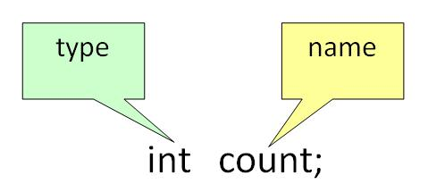
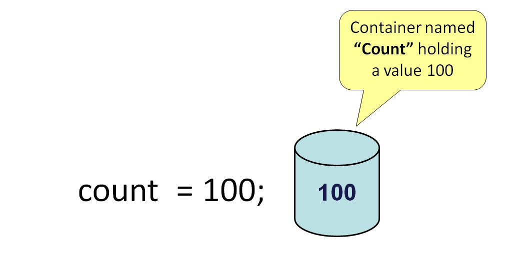
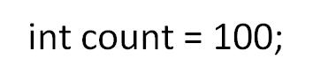
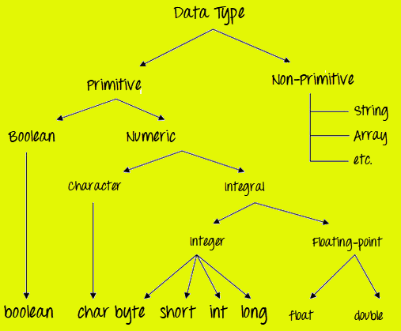
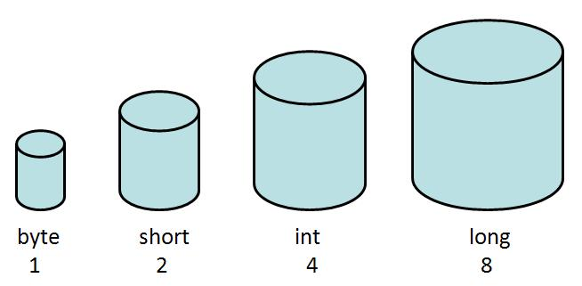
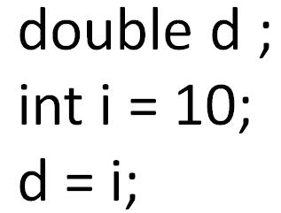
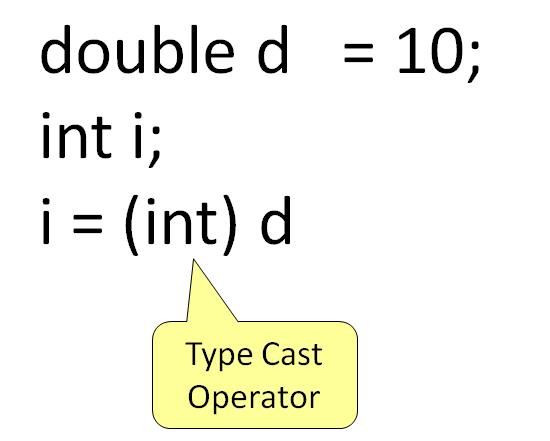

# Một biến trong Java là gì
Một biến có thể được hiểu là một thùng chứa giá trị cho bạn, trong suốt vòng đời của một chương trình Java. Mỗi biến được gán một kiểu dữ liệu mà được chỉ định kiểu và số lượng giá trị mà nó có thể chứa

Để sử dụng một biến trng một chương trình, bạn cần thực hiện 2 bước:
- Khai báo biến
- Khởi tạo biến

# Khai báo biến
Để khai báo một biến, bạn cần chỉ định kiểu dữ kiệu và đưa cho biến một cái tên duy nhất.



Ví dụ cho khai báo biến:
```java
int a,b,c;

float pi;

double d;

char a;
```

# Khởi tạo biến
Để khởi tạo biến, bạn cần gán nó một giá trị hợp lệ



Ví dụ cho khởi tạo biến:
```java
pi =3.14f;

do =20.22d;

a=’v’;
```

Bạn cũng có thể kết hợp khai báo và khởi tạo giá trị cho biến



Ví dụ: 
```java
int a=2,b=4,c=6;

float pi=3.14f;

double do=20.22d;

char a=’v’;
```

# Kiểu của biến
Trong Java, có 3 kiểu biến:
1. Biến local
2. Biến instance
3. Biến static

## 1. Biến local
Biến local là một biến mà được khai báo bên trong phần thân của một method.

## 2. Biến instance
Biến instance là biến được định nghĩa không có từ khóa STATIC. Chúng được khai báo bên ngoài method. Chúng là những đối tượng cụ thể và được hiểu là biến instance.

## 3. Biến static
Biến static là chỉ khởi tạo một lần, ở lúc bắt đầu thực thi chương trình. Nhứng biến đó nên được khởi tạo đầu tiên, trước khởi tạo của bất cứ biến instance nào.

## Ví dụ về các kiểu của biến
```java
class Guru99 {
    int data = 99; //instance variable  
    static int a = 1; //static variable  
    void method() {
        int b = 90; //local variable  
    }
}
```

# Kiểu dữ liệu trong Java
Kiểu dữ liệu phân loại các giá trị khác nhau sẽ được lưu trữ vào biến. Trong Java, có 2 loại kiểu dữ liệu.
1. Kiểu dữ liệu nguyên thửy
2. Kiểu dữ liệu không nguyên thửy



## Kiểu dữ liệu nguyên thửy
Kiểu dữ liệu nguyên thủy được xác định trước và hợp lệ trong ngôn ngữ Java. Giá trị nguyên thủy không chia sẻ trạng thái với các giá trị nguyên thủy khác.

Có 8 kiểu dữ liệu nguyên thủy: byte, short, int, long, char, float, double, and boolean 
### Kiểu dữ liệu số nguyên - Integer
```java
byte (1 byte)
short (2 bytes)
int (4 bytes)
long (8 bytes)
```



### Kiểu dữ liệu Float
```java
float (4 bytes)

double (8 bytes)
```
### Kiểu dữ liệu văn bản
```java
char (2 bytes)
```
### Kiểu dữ liệu logic
```java
boolean (1 byte) (true/false)
```
### Java data type
| **Data Type**| **Default Value** | **Default size** |
|:-------------|:------------------|:-----------------|
| byte	       | 0	               | 1 byte           |
| short	       | 0		           | 2 bytes          |
| int	       | 0	           	   | 4 bytes          |
| long	       | 0L		           | 8 bytes          |
| float	       | 0.0f		       | 4 bytes          |
| double	   | 0.0d		       | 8 bytes          |
| boolean	   | false	           | 1 bit            |
| char	       | '\u0000'		   | 2 bytes          |

### Những điểm cần nhớ
- Tất cả các loại dữ liệu số được gán giá trị
- Kích thước của kiểu dữ liệu là giống nhau trên tất cả nền tảng(đã được chuẩn hóa)
- Kiểu dữ liệu **char** là 2 bytes vì nó dùng bộ ký tự UNICODE. Nhờ có nớ nên Java hỗ trợ quốc tế hóa. UNICODE là bộ ký tự bao gồm tất cả các chữ viết được biết đến trên thế giới.

# Chuyển đổi và ép kiểu biến Java
Một biến của một kiểu dữ liệu có thể nhận giá trị của một kiểu khác. Ở đây có 2 trường hợp:

## Trường hợp 1: 
Biến của kiểu có sức chứa nhỏ hơn được gán cho biến có kiểu có sức chứa lớn hơn.



Quy trình này là tự động, và không rõ ràng nên được biến như là Conversion - chuyển đổi ngầm.
## Trường hợp 2:
Biến của kiểu có sức chứa lớn hơn được gán cho biến có kiểu có sức chứa nhỏ hơn.



Trong các trường hợp như vậy, bạn phải xác định rõ ràng toán tử ép kiểu. Quá trình này được gọi là Casting - ép kiểu.

Ví dụ: Thực hành để hiểu ép kiểu 

**Step 1**: Copy đoạn code bên dưới vào editor.
```java
class Demo {
    public static void main(String args[]) {
        byte x;
        int a = 270;
        double b = 128.128;
        System.out.println("int converted to byte");
        x = (byte) a;
        System.out.println("a and x " + a + " " + x);
        System.out.println("double converted to int");
        a = (int) b;
        System.out.println("b and a " + b + " " + a);
        System.out.println("\ndouble converted to byte");
        x = (byte)b;
        System.out.println("b and x " + b + " " + x);
    }
}
```
**Step 2**: Lưu lại, biên dịch và chạy code. Kết quả là:
```java
int converted to byte
a and x 270 14
double converted to int
b and a 128.128 128

double converted to byte
b and x 128.128 -128
```

[Back](./)
