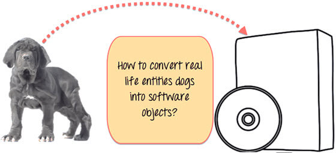
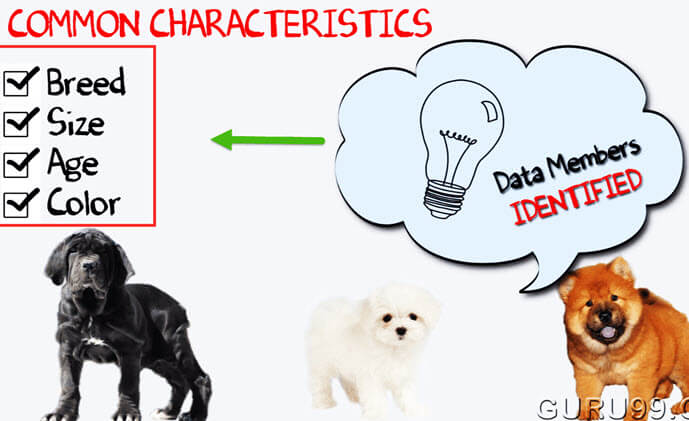
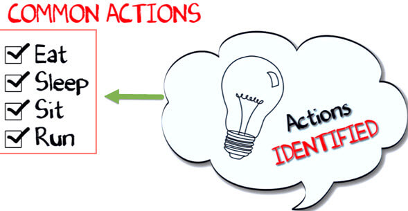
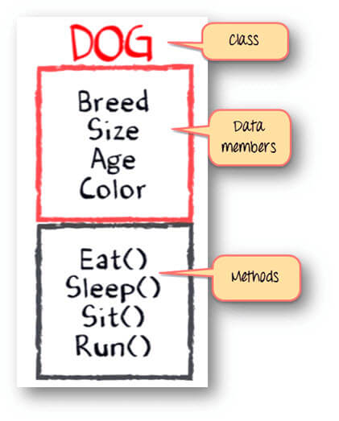

Class và Object là những thành phần cơ bản của OOPs, Thường có một sự nhầm lẫn giữa Class và Object. Trong hướng dẫn này, chúng tôi sẽ cố gắng cho bạn hiểu sự khác nhau giữa Class và Object.

# Class là gì 
Một clas là một thực thể mà xác định cách mà một Object hành xử và những gì Object sẽ chứa. Nói cách khác, nó là một bản thiết kế chi tiết hoặc là một tập hợp các hướng dẫn để xấy dựng một loại đối tượng cụ thể.

## Cú pháp:
```java
class <class_name>{  
    field;  
    method;  
  }  
```

# Object là gì
Một Object không là gì ngoài một thành phần độc lập bao gồm những phương thức và thuộc tính để làm cho một kiểu dữ liệu cụ thể trở nên có ích. Object xác định hành vi của một Class. Khi bạn gửi một thông điệp đến một Object, bạn đang yêu cầu đối tượng gọi hoặc thực thi một trong phương thức của nó.

Từ quan điểm lập trình, một đối tượng có thể là một cấu trúc dữ liệu, một biến hoặc là một chức năng. Nó có một vị trí bộ nhớ được phân bổ. Đối tượng được thiết kế dưới dạng phân cấp class.

## Cú pháp:
```java
ClassName ReferenceVariable = new ClassName();
```

# Sự khác nhau giữa Class và Object là gì 
- Một là class là một bản thiết kế chi tiết hoặc là nguyên mẫu được định nghĩa các biến và phương thức dùng chung cho tất cả các đối tượng của 1 loại nhất định.
- Một đối tượng là một mẫu vật của class. Đối tượng phần mềm thường được sử dụng để mô hình các đối tượng trong thế giới thực mà bạn tìm thấy trong cuộc sống hàng ngày.

# Hiểu về khái niệm của Class và Object trong Java với một ví dụ:
Hãy lấy một ví dụ về phát triển hệ thống quản lý thú cưng, đặc biệt dành cho những chú chó. Bạn sẽ cần những thông tin khác nhau về những chú chó như giống chó, tuổi, kích thước, ...

Bạn cần mô hình hóa những sinh vật ở cuộc sống thực, ví dụ như những chú chó vào thực thể phần mềm.



Hơn thế nữa, một câu hỏi nữa là, làm sao để bạn thiết kế một phần mềm như vậy? Và đây là giải pháp!

Đầu tiên, hãy làm một bài tập.

Bạn có thể thấy bức ảnh của ba loại chó khác nhau bên dưới.


Dừng lại, liệt kê những điểm khác nhau giữa chúng.

Một số sự khác nhau bạn có thể liệt kê ra có lẽ là giống chó(breed), tuổi(age), kích thước(size), ... Nếu bạn suy nghĩa 1 vài phút, những điểm khác nhau này cũng là những đặc điểm chung được chia sẻ cho những chú chó này. Những đặc điểm (breed, age, size, color) có thể tạo thành những dữ liệu cho đối tượng của bạn.



Tiếp theo, liệt kê những hành vi chung của những chú chó này như ngủ(sleep), ngồi(sit), ăn(eat)... Vậy, những thứ này sẽ là những hành động trong đối tượng phần mềm của bạn.



Cho đến bây giờ, chúng ta đã định nghĩa được những thứ như dưới đây:

**Class** - Dogs
**Data members or objects**- size, age, color, breed, etc.
**Methods**- eat, sleep, sit and run.



Bây giờ, đối với những giá trị khác nhau của các dữ liệu (breed size, age, and color) trong Java class, bạn sẽ nhận được các đối tượng khác nhau. 


**Bạn có thể thiết kế bất cứ chương trình nào bằng cách tiếp cận OOP này.**

Trong khi tạo một class, người ta phải tuân thủ các nguyên tắc sau:
- Single Responsibility Principle (SRP)- Một class chỉ nên có một lý do để thay đổi.
- Open Closed Responsibility (OCP)- Nó nên cho phép để bất cứ class nào mở rộng mà không chỉnh sửa nó.
- Liskov Substitution Responsibility (LSR)- Các lớp con phải được thay thế cho các lớp cơ sở của chúng.
- Dependency Inversion Principle (DIP)- Phụ thuộc vào sự trừu tượng hay không phụ phuộc.
- Interface Segregation Principle (ISP)- Chuẩn bị các giao diện hạt mịn là khách hàng cụ thể.

# Code ví dụ về Class và Object:
```java
// Class Declaration
public class Dog {
    // Instance Variables
    String breed;
    String size;
    int age;
    String color;

  
    // method 1
    public String getInfo() {
        return ("Breed is: "+breed+" Size is:"+size+" Age is:"+age+" color is: "+color);
    }
    

    public static void main(String[] args) {
        Dog maltese = new Dog();
        maltese.breed="Maltese";
        maltese.size="Small";
        maltese.age=2;
        maltese.color="white";
        System.out.println(maltese.getInfo());
    }
}
```
## Kết quả:
```java
Breed is: Maltese Size is:Small Age is:2 color is: white
```

# Code ví dụ về Class và Object với phương thức main bên ngoài Class
Trong chương trình trước, chúng ta tạo một method main() bên trong Class. Bây giờ, chúng ta tạo class và định nghĩa method main() trong một khác. Đây là cách tốt hơn so với cách trước.

```java
// Class Declaration
class Dog {
    // Instance Variables
    String breed;
    String size;
    int age;
    String color;

  
    // method 1
    public String getInfo() {
        return ("Breed is: "+breed+" Size is:"+size+" Age is:"+age+" color is: "+color);
    }
}
public class Execute{
    public static void main(String[] args) {
        Dog maltese = new Dog();
        maltese.breed="Maltese";
        maltese.size="Small";
        maltese.age=2;
        maltese.color="white";
        System.out.println(maltese.getInfo());
    }
} 
```

## Kết quả:
```java
Breed is: Maltese Size is:Small Age is:2 color is: white
```

# Tổng kết:
- Java class là một thực thể xác định cách mà một đối tượng hành xử và những gì đối tượng sẽ chứa.
- Một đối tượng Java là một thành phần độc lập bao gồm những phương thức và thuộc tính để làm cho một loại dữ liệu nhất định trở nên hữu ích.
- Một hệ thống class cho phép chương trình định nghĩa một class mới(class con) trong chỉ định của một class hiện có(class cha) bởi những kỹ thuật như kế thừa, ghi đè và mở rộng.


[Back](./)
