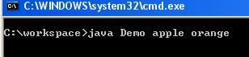
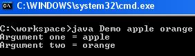

# Command Line Arguments trong Java là gì 
Command Line Arguments trong Java - Đối số dòng lệnh là thông tin được truyền vào cho chương trình khi bạn chạy chương trình. 
Thông tin được truyền vào được lưu dưới dạng một mảng String trong mehod **main**. 
Sau đó bạn có thể sử dụng các đối số dòng lệnh này trong chương trình của bạn.

Ví dụ: Trong khi bạn chạy một clas **Demo**, bạn có thể chỉ định các đối số dòng lệnh như sau:
```bash
java Demo arg1 arg2 arg3 ...
```

# Command Line Arguments trong Java: Các điểm quan trọng.
- Command Line Arguments có thể được sử dụng để chỉ định thông tin cấu hình trong khi bạn khởi chạy ứng dụng của bạn.
- Không có hạn chế về số lượng Command Line Arguments, bạn có thể chỉ định bất kỳ số lượng argument.
- Thông tin được truyền vào dưới dạng String.
- Chúng sẽ được đưa vào mảng String của method **main**

# Ví dụ:
**Step 1. Định nghĩa 1 class**:
```java
class Demo {
  public static void main(String arg[]) {
    System.out.println("Argument one = " + arg[0]);
    System.out.println("Argument two = " + arg[1]);
  }
}
```

**Step 2: Lưu và Compile**

**Step 3: Chạy code với lệnh "java Demo apple orange"**




**Step 4: Kết quả:**



[Back](./)
