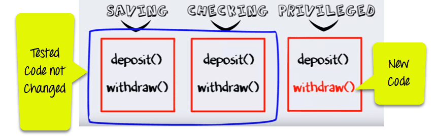
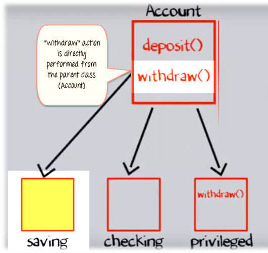
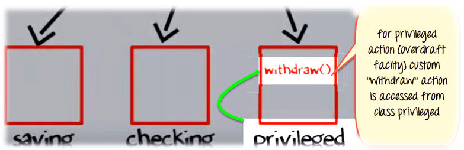
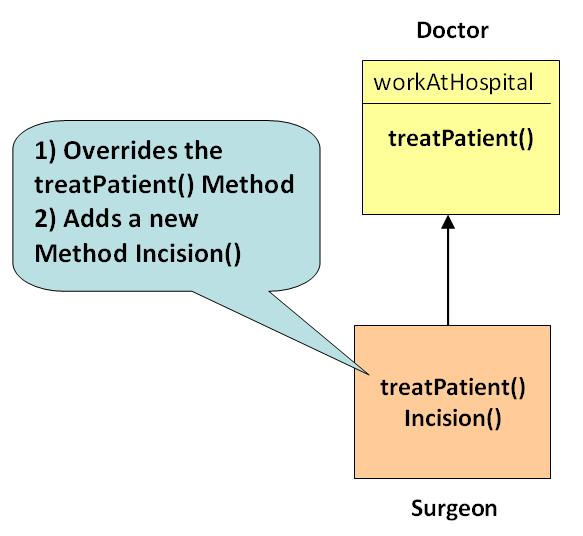
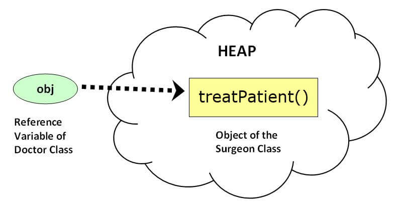

# Đa hình là gì ?
Đa hình là một khái niệm quan trọng trong OOPs, nơi mà một cái tên có rất nhiều dạng.

Ví dụ: Bạn có một chiếc điện thoại thông minh để giao tiếp. Phương thức giao tiếp bạn chọn có thể là bất cứ thứ gì. Nó có thể là một cuộc gọi, một tin nhắn, một tin nhắn hình, mail, ... Vậy nên, mục tiêu phổ biến là giao tiếp, nhưng các tiếp cận là khác nhau. Đó gọi là **Đa hình**

# Đa hình trong Java OOPs với ví dụ:
Chúng ta có một class cha **Account** với chức năng là **nộp tiền** và **rút tiền**. Account có 2 class con.

Hoạt động của **nộp tiền** và **rút tiền** là giống nhau ở Saving và Checking tài khoản. Vậy nên, method kế thừa từ class Account sẽ làm việc.


## Thay đổi yêu cầu phần mềm
Có một thay đổi trong đặc điểm kỹ thuật phần mềm, một thứ mà rất phổ biến trong ngành công nghiệp phần mềm.
Giả sử bạn thêm chức năng đặc quyền vào Banking Account với cơ sở thấu chi

Về nền tẳng, thấu chi là một đặc quyền mà bạn có thể rút tiền một số nhiều hơn số dư hợp lệ bạn có trong tài khoản.

Vì vậy, method **rút tiền** for đặc quyền cần được triển khai một lần nữa. Nhưng bạn không thể thay đổi những vùng code đã được kiểm tra trong Saving và Checking account. Đó là tính năng của OOPs.



**Bước 1**: Khi method **rút tiền** trong class Saving được gọi thì một method ở class cha sẽ được thực thi.



**Bước 2**: Nhưng khi method **rút tiền** trong class đặc quyền được gọi thì method **rút tiền** định nghĩa ở chính class đặc quyền thực thi. Đó là **Đa hình**



# Method Overriding
Method Overriding là định nghĩa lại một method ở class cha trong một class con.

## Nguyên tắc Method Overriding
- Định danh của method như tên method, tham số, kiểu trả về cần phải khớp hoàn toàn với class cha
- Overriding method có thể mở rộng khả năng truy cập nhưng không thể hẹp lại. Nếu nó là một private trong class cha thì class con có thể làm thành public nhưng không thể ngược lại.



## Ví dụ: 
```java
class Doctor{
  public void treatPatient(){
  // treatPatient method
  
}
class Surgeon extends Doctor{
  public void treatPatient(){
  // treatPatient method
  }
}
Class run{
  public static void main (String args[]){
    Doctor doctorObj = new Doctor()
	// treatPatient method in class Doctor will be executed
    doctorObj.treatPatient();
   
    Surgeon surgeonObj = new Surgeon();
    // treatPatient  method in class Surgeon  will be executed
    surgeonObj.treatPatient();
  }
}
```

# Sự khác nhau giữa Overloading và Overriding
## Method Overloading
Method Overloding là trong cùng class, nơi nhiều hơn một method có tên giống nhau nhưng khác nhau ở định danh như là tham số truyền và kiểu data trả về

**Ví dụ**: 
```java
void sum (int a , int b);
void sum (int a , int b, int c);
void sum (float a, double b);
```

## Method Overriding
Method Overriding là khi một method của class cha được định nghĩa lại trong class con. Trong trường hợp này, định danh method phải giống nhau.

**Ví dụ**:
```java
class X{
  public int sum(){
     // some code
  }
}

class Y extends X{
  public int sum(){
    //overridden method
   //signature is same
 }
}
```

# Đa hình động là gì ?
Đa hình động là một cơ chế mà nhiều method có thể định nghĩa với tên giống nhau và định danh giống nhau trong class cha và class con. Quá trình gọi đến method overriding sẽ được xử lý lúc chạy chương trình.

## Ví dụ về Đa hình động 
Một biến tham chiếu của một class cha có thể tham chiếu đến đối tượng class con.
```java
 Doctor obj = new Surgeon();
```

Xem xét câu lệnh:
```java
obj.treatPatient();
```

Ở đây, biến tham chiều **obj** là của class cha, nhưng đối tượng thì trỏ đến clsas con như hình dưới đây.



**obj.treatPatient();** sẽ thực hiện là **obj.treatPatient();** định nghĩa trong class con.

Nếu một tham chiếu của class cơ sở được sử dụng để gọi một method, method sẽ được gọi bởi chỉ định của JVM, tùy thuộc vào đối tượng tham chiếu mà nó trỏ tới.

Ví dụ, mặc dù **obj** là đối tượng tham chiếu của **Doctor**, nó gọi method của **Surgeon** vì nó trỏ đến đối tượng **Surgeon**

Đó là chỉ định trong khi chạy chương trình, vì vậy được chỉnh định bởi đa hình dynamic hoặc run-time 

# Từ khó super
Điều gì xảy ra nếu method treatPatient trong class Surgeon muốn thực thi một số chức năng đã được định nghĩa trong class cha và sau đó nó thực hiện chức năng chỉ định của chính nó.

Trong trường hợp này, từ khóa **super** có thể được sử dụng để truy cập các method của class cha từ class con.

Method treatPatient trong clsas Surgeon sẽ được viết như dưới đây
```java
treatPatient(){
   super.treatPatient();
     //add code specific to Surgeon
}
```

Từ khóa **super** có thể được sử dụng để truy cập data member và method của class từ clsas con.

# Ví dụ: Để hiểu Kế thừa, Đa hình và từ khóa super

**Step 1**: Copy đoạn mã sau vào notepad
```java
public class Test{
     public static void main(String args[]){
        X x= new X();
       Y y = new  Y();
       y.m2();
      //x.m1();
      //y.m1();
     //x = y;// parent pointing to object of child
     //x.m1() ;
     //y.a=10;
   }

}
class X{
   private int a;
   int b;
      public void m1(){
       System.out.println("This is method m1 of class X");
     }
}

class Y extends X{
      int c; // new instance variable of class Y
         public void m1(){
            // overriden method
            System.out.println("This is method m1 of class Y");
        }
       public void m2(){
           super.m1();
           System.out.println("This is method m2 of class Y");
      }
}
```

**Step 2**: Lưu, biên dịch và chạy chương trình. Kiểm tra kết quả.

**Step 3**: Bỏ comment và chạy lại. Quan sát kết quả.
```java
    x.m1();
    y.m1();
    x = y;// parent pointing to object of child
    x.m1() ;
```

**Step 4**: Bỏ comment và chạy lại. Quan sát kết quả.
```java
y.a=10;
```

**Step 5**: Có phải lỗi không ? Đây là vì class con không thể truy cập biến private ở clsas cha.

# Sự khác nhau giữa đa hình Static và Dynamic
## Đa hình static
- Nó liên quan đến method overloading
- Lỗi, nếu có, nó sẽ được xử lý lúc biên dịch, vì mã không thể thực thi trong khi hoàn thành biên dịch, vì vậy có tên là static
- Ví dụ: 
```java
void sum (int a , int b);
void sum (float a, double b);
int sum (int a, int b); //compiler gives error.
```

# Đa hình dynamic
- Nó liên quan đến method overriding
- Trong trường hợp, biến tham chiếu đang gọi đến một method overriding, method sẽ được gọi được xác định bởi object mà biến tham chiếu của bạn trỏ tới. Nó chỉ có thể xác định lúc chạy chương trình khi mã code ở bên trong trình thực thi, do đó gọi nó là dynamic
- Ví dụ:
```java
//reference of parent pointing to child object
 Doctor obj = new Surgeon();
// method of child called
obj.treatPatient();
```

[Back](./)
