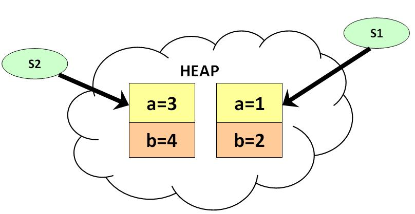
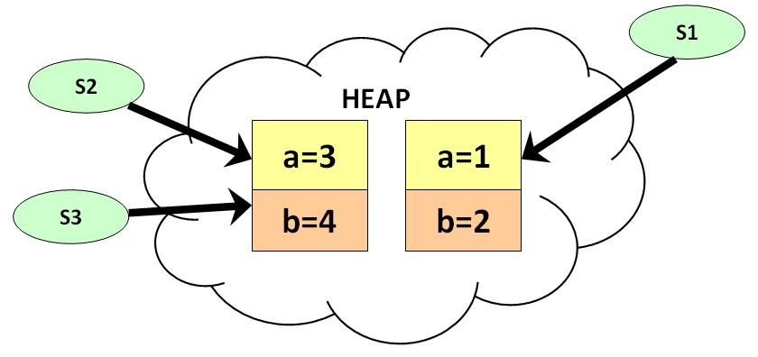
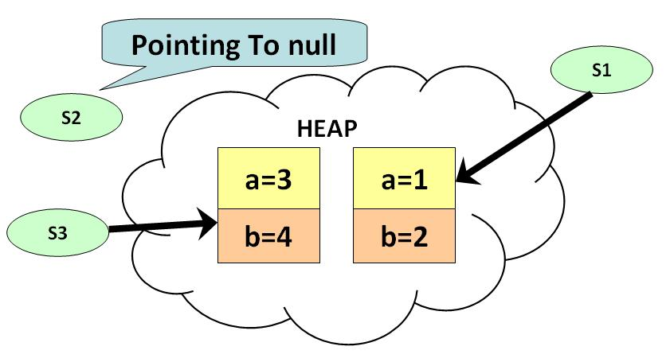
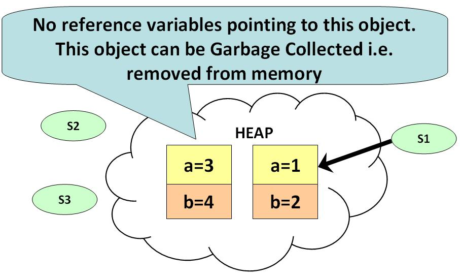
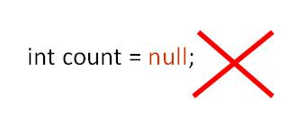

# Garbage Collection trong Java là gì
Garbage Collector là chương trình quản lý bộ nhớ, trong đó việc phân bổ lại các đối tượng được thực hiện bởi Java chứ không phải bởi người phát triển. Trong ngôn ngữ lập trình Java, phân bổ tự động toán tử mới được thực hiện thông qua từ khóa **new**. Một đối tượng một khi được tạo ra sẽ sử dụng một số bộ nhớ và bộ nhớ vẫn được phân bổ khi có các tam chiếu sử dụng đối tượng đó.

Khi không có các tham chiếu đến một đối tượng, nó được coi là không còn cần thiết, và bộ nhớ, bị chiếm bởi đối tượng hoang phí. Nó rõ ràng cần cần xóa bỏ một đối tượng và Java sẽ tự động phân bổ lại.

Kỹ thuật thực hiện việc này được biết đến như là **Grabage Collection**. Những chương trình không phân bổ lại bộ nhớ có thể bị sập khi mà không còn bộ nhớ trong hệ thống để phân bổ. Những chương trình như vậy được gọi là **memory leaks**.

**Grabage Collection** trong Java thực hiện tự động trong suốt vòng đời của chương trình. Sự loại bỏ là cần thiết để phân bổ lại bộ nhớ và nhờ cách đó mà vượt qua được **memory leask**. Trong ngôn ngữ C, nó là trách nhiệm của người phát triển, để phân bổ bộ nhớ động thì sử dụng function **free()**.
Đây là điểm mà Java memory management vượt trội.

**Lưu ý**: Tất cả các đối tượng đều được tạo trong vùng **Heap** của bộ nhớ Java. Chúng ta sẽ tìm hiểu kỹ hơn ở hướng dẫn sau.

# Ví dụ: Cơ chế của Garbage Collection trong Java
**Step 1**: Copy đoạn code sau và notepad:
```java
class Student{
int a;
int b;

  public void setData(int c,int d){
    a=c;
    b=d;
  }
  public void showData(){
    System.out.println("Value of a = "+a);
    System.out.println("Value of b = "+b);
  }
  public static void main(String args[]){
    Student s1 = new Student();
    Student s2 = new Student();
    s1.setData(1,2);
    s2.setData(3,4);
    s1.showData();
    s2.showData();
    //Student s3;
    //s3=s2;
    //s3.showData();
    //s2=null;
    //s3.showData();
    //s3=null;
    //s3.showData();
  }
}
```

**Step 2**: Lưu lại, biên dịch và chạy chương trình. Như thể hiện trong sơ đồ, có 2 đối tượng và 2 tham chiếu được tạo. 



**Step 3**: Bỏ comment đoạn mã dưới, biên dịch và chạy lại.
```java
    Student s3;
    s3=s2;
    s3.showData();
```

**Step 4**: Như sơ đồ bên dưới thể hiện, có 2 biến cùng tham chiếu đến cùng đối tượng. 



**Step 5**: Bỏ comment đoạn mã dưới, biên dịch và chạy lại.
```java
    s2=null;
    s3.showData();
```

**Step 6**: Như sơ đồ bên dưới thể hiện, **s2** là **null**, nhưng **s3** vẫn tham chiếu đến đối tượng nên không đủ điều kiện để  **Garbage Collection** xử lý.



**Step 7**: Bỏ comment đoạn mã dưới, biên dịch và chạy lại.
```java
    s3=null;
    s3.showData();
```

**Step 8**: Ở bước này, không còn tham chiếu nào đến đối tượng và đã đủ điều kiện để **Garbage Collection** xử lý. Đối tượng sẽ được loại khỏi bộ nhớ và không có các nào để lấy lại. Lỗi *java.lang.NullPointerException** sẽ xuất hiện.



# Làm thế nào để xóa một đối tượng trong Java
1. Nếu bạn muốn làm đối tượng của bạn đủ điều kiện để **Garbage Collection** xử lý. Bạn gán biến tham chiếu đến nó là **null**
2. Giá trị nguyên thủy không phải là đối tượng nên không thể gán **null** cho nó.



[Back](./)
