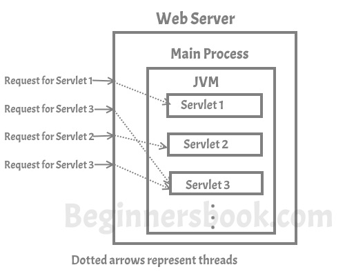

Servlet là một chương trình chạy bên trong JVM trên máy chủ web. Nó được sử dụng phát triển ứng dụng web động.

Trước tiên, chúng ta cần hiểu thêm về **ứng dụng web động** là gì ? Một ứng dụng web có thể được mô tả bởi một tập hợp các trang web, và khi chúng ta gọi nó động, nó đơn giản có nghĩa là trang web không giống nhau cho tất cả người dùng, trang web sẽ tự động được tạo ra trên máy chủ web dựa trên yêu cầu của phía người dùng(user browers)

Điểm khác nhau chính giữa trang web động và trang web tĩnh là trang web tĩnh thì giống nhau với tất cả người dùng, tuy nhiên trang web động có có thể thay đổi dựa trên request của phía người dùng. Ví dụ: Xem xét một ứng dụng web mà hiển thị cho bạn 2 input fields và 1 button, khi bạn nhập số và click button, nó sẽ hiển thị một trang web khác mà ở đó sẽ hiển thị 2 số bạn vừa nhập, ứng dụng web này là động như trang web thứ 2 của bạn, nó cho thấy kết quả dựa trên giá trị nhập vào của người dùng và nó không giống nhau với tất cả người dùng.

Tuy nhiên, bạn có thể nói rằng những gì servlet làm là được thực hiện bởi CGI(Common Gateway Interface), nó đúng nhưng ở đây có một điều - CGI có một số giới hạn như hiệu suất, khả năng mở rộng, tái sử dụng ... mà một servlet không có. Tôi sẽ không trao đổi về chi tiết CGI nhưng tôi sẽ nói cho bạn biết, làm thế nào mà một servlet là tốt hơn CGI

# Giới hạn của CGI
Server sẽ tạo một xử lý CGI mới cho mỗi request từ người dùng. Ví dụ: nếu có 100 người dùng truy cập ứng dụng web, thì server sẽ tạo 100 CGI process để xử lý yêu cầu được tạo từ chúng. Vì một server hạn chế về tài nguyên, việc tạo mới process mỗi lần cho một yêu cầu mới không phải là lựa chọn khả thi. Điều này đã áp đặt giới hạn trên máy chủ, do đó, server không thể xử lý nhiều hơn một số người dùng được chỉ định trong một thời điểm.

# Làm thế nào Servlet tốt hơn CGI
Chương trình CGI được xử lý bởi một xử lý mới mỗi lần một yêu cầu mới được tạo ra. Không giống CGI, chương trình servlet được xử lý bởi các luổng tách rời mà có thể chạy kiêm nhiệm nên mang lại hiệu quả cao hơn.

Chương trình CGI có thể được viết bởi bất cứ ngôn ngữ lập trình nào mà làm nó trở nên phụ thuộc vào nền tảng vì không phải tất cả các ngôn ngữ lập trình đều độc lập nền tảng. Servlet chỉ sử dụng Java là ngôn ngữ lập trình, điều đó làm cho nó độc lập nền tảng và dễ di động. Lợi ích khác của Java là servlet có thể tận dụng những tính năng của ngôn ngữ lập trình hướng đối tượng của Java

# Servlet làm việc như thế nào
Như tôi dã đề cập ở trên rằng yêu cầu đồng thời gới đến máy chủ web được thực hiện bởi các threads, đây là hình vẽ thể hiện điều đó:

# Tính năng của Servlet
Bây giờ chúng ta đã hiểu servlet là gì, và mục đích nó được sử dụng là gì. Tiến lên và tìm hiểu thêm về các tính năng cơ bản của servler.

